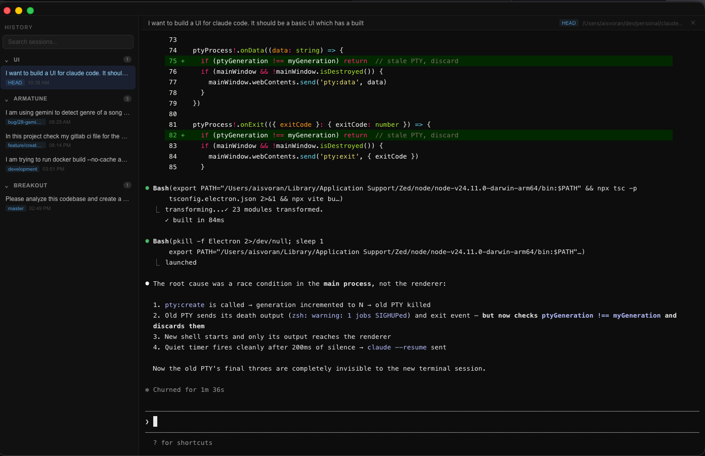

# Claude UI

A desktop interface for [Claude Code](https://claude.ai/code) with a built-in terminal and conversation history sidebar.



## Features

- **Full terminal** — runs your shell so you can use `claude` exactly as you would in any terminal
- **Conversation history** — sidebar reads `~/.claude/projects/` and shows all past sessions grouped by project
- **One-click resume** — click any session to run `claude --resume <id>` automatically in the correct project directory
- **Search** — filter sessions across all projects instantly
- **Resizable sidebar** — drag the divider to adjust layout
- **Git branch badges** — each session shows the branch it was started on

## Requirements

- macOS (tested on macOS 14+)
- [Claude Code](https://claude.ai/code) installed and on your PATH (`claude` command must work in your shell)
- Node.js 18+

## Getting Started

```bash
git clone https://github.com/yourusername/claude-ui.git
cd claude-ui
npm install
npm run rebuild-pty   # builds node-pty native module for Electron
npm run start
```

> **Note:** The `rebuild-pty` step is required once after install. It compiles the native terminal bindings for Electron's version of Node.

## Usage

### Terminal

The main panel is a full interactive terminal running your default shell (`$SHELL`). Use it like any terminal — run `claude`, navigate directories, etc.

### Conversation History

The left sidebar lists all Claude Code sessions from `~/.claude/projects/`, grouped by project and sorted by recency.

**To resume a past session:** click it in the sidebar. The terminal will restart in that project's directory and automatically run `claude --resume <session-id>`.

**To start fresh:** click the **✕** button in the session bar at the top of the terminal area.

**To search:** type in the search box at the top of the sidebar to filter by session title or project name.

## Development

```bash
npm install
npm run rebuild-pty
npm run dev          # starts Vite dev server + Electron with hot reload
```

The dev workflow runs two processes concurrently:
- `vite` serves the React renderer on `localhost:5173`
- `electron .` connects to the dev server and watches for changes

To rebuild just the Electron main process after changes to `electron/`:

```bash
npx tsc -p tsconfig.electron.json
NODE_ENV=production npx electron .
```

## Project Structure

```
claude-ui/
├── electron/
│   ├── main.ts        # Electron main process: window, PTY, IPC
│   ├── preload.ts     # contextBridge API exposed to renderer
│   ├── history.ts     # Reads and parses ~/.claude/projects/ JSONL files
│   └── types.ts       # Shared types (Session, Project, ChatMessage)
├── src/
│   ├── App.tsx                    # Root layout and session state
│   ├── components/
│   │   ├── TerminalPanel.tsx      # xterm.js terminal + PTY IPC
│   │   └── Sidebar.tsx            # History browser with search
│   └── types.ts                   # Frontend types + ElectronAPI declaration
└── dist-electron/     # Compiled Electron main process (git-ignored)
    dist-renderer/     # Built React app (git-ignored)
```

## How It Works

- **Terminal:** Uses [node-pty](https://github.com/microsoft/node-pty) to spawn a real PTY (pseudoterminal) connected to your shell, and [xterm.js](https://xtermjs.org/) to render it in the Electron window.
- **History:** Claude Code stores sessions as JSONL files in `~/.claude/projects/`. Each file is a conversation — `history.ts` parses these, strips system-injected XML tags, and surfaces them in the sidebar.
- **Resume:** Clicking a session restarts the PTY in that project's `cwd`, then waits for the shell prompt (detected via 200ms quiet period) before sending `claude --resume <session-id>`.

## License

MIT
